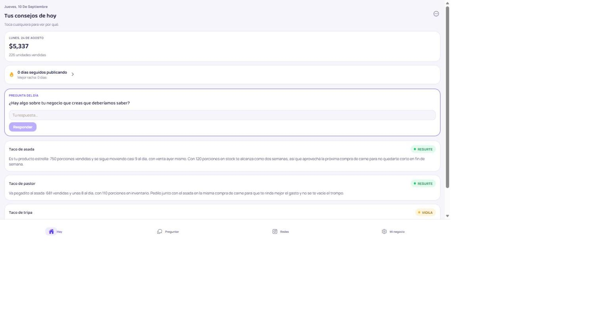
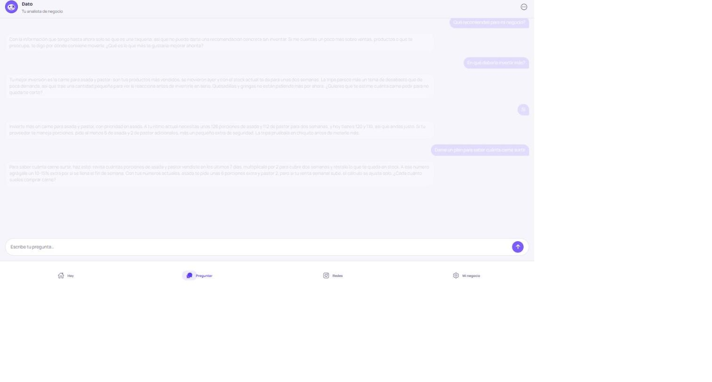
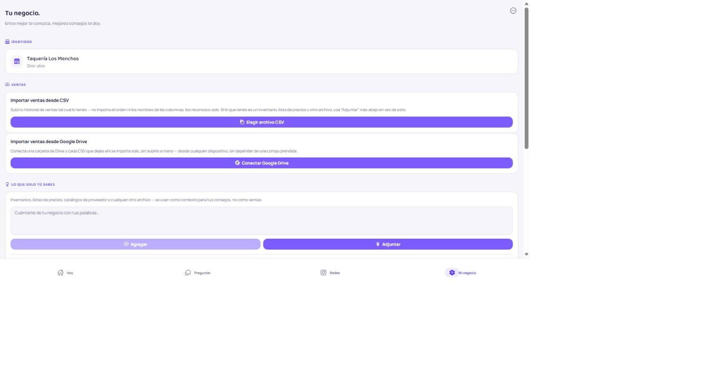
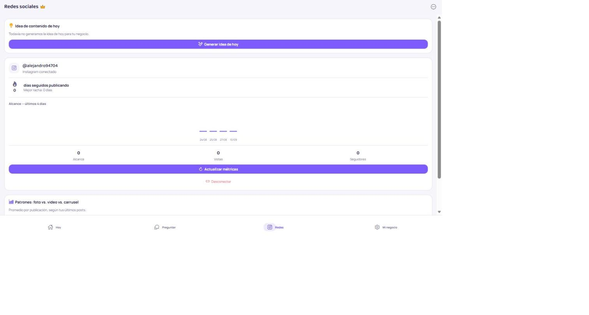
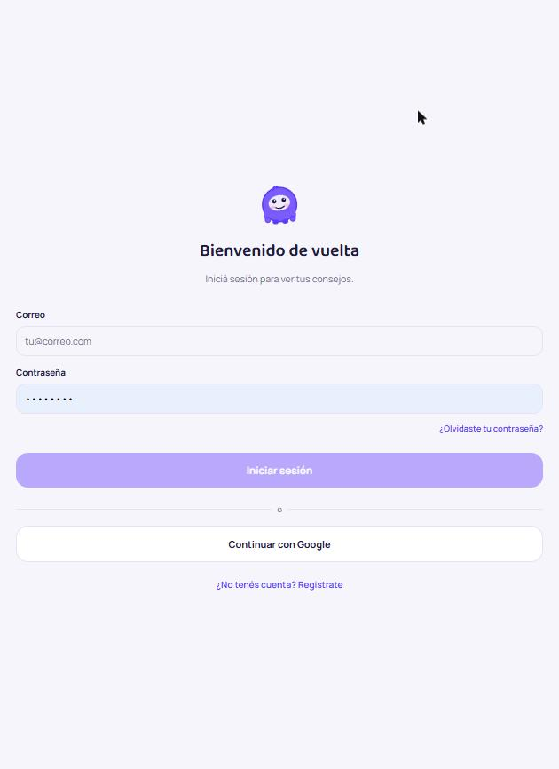

# El Asesor

**Un asesor de negocio para comercios que ya venden, no un dashboard.** Cada día, la app revisa
las ventas del negocio y entrega una decisión accionable — qué resurtir, qué dejar de pedir, qué
vigilar — en lenguaje llano, con los datos que la respaldan. Nada de gráficas para interpretar:
la conclusión ya viene hecha.

El producto es **universal por giro**: una taquería, una zapatería o una tienda de abarrotes usan
el mismo motor. No hay reglas de negocio codificadas a mano por rubro — es el LLM el que razona
sobre las ventas, apoyado en señales y umbrales genéricos como grounding, y decide.

[](https://github.com/sachaguz/Asesor/actions/workflows/backend-tests.yml)
[](https://github.com/sachaguz/Asesor/actions/workflows/frontend-checks.yml)
[](LICENSE)

---

## Capturas

| Consejos del día | Chat con "Dato" | Mi negocio |
|---|---|---|
|  |  |  |

| Redes sociales | Login |
|---|---|
|  |  |

*Capturas tomadas contra el backend real (`expo start --web`), con datos de una taquería de prueba.*

---

## Qué hace

- **Consejo del día con IA que decide, no solo redacta.** El LLM (Claude) recibe las señales
  calculadas sobre las ventas (rotación, stock, tendencia) y las reglas genéricas del giro como
  grounding, y a partir de ahí razona el veredicto — `RESURTE` / `NO_PIDAS` / `VIGILA` — con su
  propia justificación. Puede anular la sugerencia de las reglas si el contexto lo amerita.
- **Importar ventas sin atarse a un punto de venta.** Subís cualquier CSV — de cualquier POS, en
  cualquier orden de columnas — y una IA barata (vía OpenRouter) detecta sola cuál columna es
  fecha, producto, cantidad y precio. También se puede dejar el CSV en una carpeta de Google
  Drive y sincronizar con un botón, sin depender de una computadora fija.
- **Chat libre con "Dato".** Preguntas de negocio en lenguaje natural, con memoria de la
  conversación y tope diario de uso para mantener el costo de IA bajo control.
- **Contexto que solo el dueño sabe.** Notas de texto libre o archivos (PDF/Excel) que el LLM usa
  como contexto adicional para el consejo — no como datos de ventas.
- **Integración con Instagram**, con métricas reales (alcance, seguidores), racha de publicación
  diaria e ideas de contenido generadas por IA según qué formato le funciona mejor a ese negocio.
- **Suscripción "Redes" vía Stripe**, con `PaymentSheet` nativo (no checkout web) y validado de
  punta a punta contra la API real de Stripe en sandbox.
- **Auth completa**: email/contraseña + Google Sign-In, verificación de correo obligatoria,
  borrado de cuenta autoservicio, JWT de larga duración pensado para una app móvil.
- **Mitigación de prompt injection** en los tres puntos donde el usuario controla texto libre que
  llega al LLM (contexto del negocio, archivos adjuntos, chat).
- **Widgets nativos de Android** (racha de Instagram, pregunta del día) y un tour de onboarding
  de 3 pasos la primera vez que se crea una cuenta.

## Por qué está construido así

El proyecto arrancó con un briefing que asumía reglas de negocio codificadas a mano por giro
(empezando por calzado, con entrevistas a expertos ya hechas) y un LLM que solo redactaba el
veredicto en lenguaje natural. Se decidió lo contrario a propósito:

- **El LLM decide, las reglas solo dan grounding.** Así el mismo motor sirve para cualquier giro
  sin codificar un árbol de reglas por rubro. Para los giros sin reglas expertas validadas (todos,
  por ahora), el consejo declara explícitamente confianza baja en vez de aparentar una certeza que
  no tiene — un consejo tonto en el primer uso mata la confianza para siempre.
- **`SalesImporter` genérico desde el día uno**, sin asumir columnas fijas de ningún POS
  particular, porque no hay un cliente piloto único al que atarse.
- **Dos proveedores de LLM separados a propósito**: uno "fuerte" (Claude, para el consejo del día
  y el chat, donde una respuesta floja cuesta caro en confianza) y uno "económico" (modelos open
  source vía OpenRouter, para pregunta del día e ideas de contenido) — para mantener el costo de
  IA en unos pocos dólares al mes sin sacrificar calidad donde importa.

## Arquitectura

```
Asesor/
├── backend/          FastAPI + PostgreSQL + SQLAlchemy/Alembic
│   ├── app/
│   │   ├── api/       Routers: auth, negocios, ventas, chat, Instagram, Drive, Stripe...
│   │   ├── llm/       Proveedores intercambiables: Claude, OpenRouter, mock
│   │   ├── rules/     Señales + reglas genéricas (grounding del LLM)
│   │   ├── services/  Lógica de negocio (import, advisor, subscripción...)
│   │   └── models/    SQLAlchemy
│   ├── migrations/    Alembic
│   └── tests/         95 tests, DB aislada propia
└── frontend/          Expo (React Native) + TypeScript
    └── src/
        ├── app/       Rutas (Expo Router): tabs, login, configuración...
        ├── components/ Mascota, tarjetas, gráficas, tour de onboarding
        ├── hooks/     Auth, suscripción, tema
        └── widgets/   Widgets nativos de Android
```

**Stack:** Python 3.12 · FastAPI · PostgreSQL · SQLAlchemy · Alembic · Anthropic (Claude) ·
OpenRouter · Stripe · Expo SDK 54 · React Native 0.81 · TypeScript · Expo Router · Reanimated.

## Cómo correrlo

### Backend

```bash
cd backend
cp .env.example .env          # completar ANTHROPIC_API_KEY, etc.
docker compose up -d          # Postgres + API en http://localhost:8000
docker compose run --rm api pytest -q   # 95 tests
```

### Frontend

```bash
cd frontend
cp .env.example .env           # apuntar EXPO_PUBLIC_API_BASE_URL al backend
npm install
npx expo start --web           # o --android / --ios con un dev client
```

## Estado del proyecto

Backend y frontend funcionando de punta a punta contra servicios reales: Postgres, Claude,
OpenRouter, Stripe (sandbox), Instagram y Google Drive. El modo live de Stripe queda pendiente de
un trámite fiscal del dueño del negocio, no de código.

## Licencia

[MIT](LICENSE)
